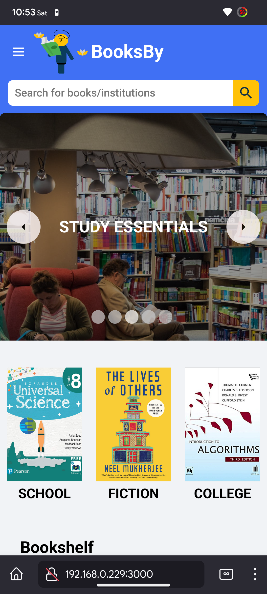

<div align="center">
<!--  -->

</div>


<br>

# BooksBy - A MERN Full Stack E-commerce Platform

 
[](https://github.com/facebook/react/blob/main/LICENSE) 
[](https://reactjs.org/docs/how-to-contribute.html#your-first-pull-request)


Welcome to the readme for the MERN (MongoDB, Express, React, Node.js) full-stack e-commerce project named BooksBy (stemmed from BooksBuy pronounced Books-Bee). This project is focused on developing an e-commerce website that specializes in selling books based on students' schools, colleges, and other institutions. The website provides a comprehensive search functionality that allows users to find books by their titles, and also displays relevant school information and the books used in the school's curriculum, if applicable.

## Project Overview

BooksBy aims to create a user-friendly and efficient platform for students and avid book readers alike to discover and purchase books specific to their educational institutions. The project utilizes the MERN stack to leverage the power of MongoDB, Express.js, React.js, and Node.js in building a robust and scalable e-commerce solution.

## Table of Contents

* ### [Features](#features-1)
* ### [Screenshots](#screenshots-1)
* ### [Getting Started](#getting-started-1)
* ### [Testing](#testing-1)
* ### [Contributing](#contributing-1)
* ### [License](#license-1)
* ### [Contact](#contact-1)

<br>

## Features

### Unique to the project

1. ### Book Search

    The project includes a powerful search component that enables users to search for books by their names. The search functionality is designed to provide accurate and relevant results, ensuring a seamless user experience. When a user searches for a book, the system retrieves all the matching books from the MongoDB database and displays them to the user.

2. ### School Information

    In addition to book search, the system also supports searching for schools by their names. If a user searches for a school, and the school name is found in the database, the website displays relevant information about the school, such as its location, contact details, and a brief description. Furthermore, if a book search result includes information about a school, an optional section is displayed at the top of the search results page dynamically, providing additional visibility to the school's information.

3. ### Curriculum Books

    To enhance the user experience, the e-commerce platform showcases the books used in a particular school's curriculum. If a user searches for a school and the search result includes information about the school, the website fetches and displays the books that are part of the school's curriculum. This feature enables students to easily find and purchase the books required for their educational programs considering how deeply coupled and associated both the books and their institutions are together in the theme of this project.

## E-commerce related

**BooksBy** offers a wide range of features to enhance the functionality and user experience of the platform. These features include:

- ### 💳 Stripe Integration (with webhooks)

  Stripe Integration enables secure and seamless online payments by integrating the Stripe payment gateway into the e-commerce platform. This feature ensures that customers can make payments efficiently and securely, promoting a smooth transaction process.

  Note: Please refer to the [Stripe webhook](https://stripe.com/docs/webhooks/) documentation for detailed instructions on how to configure and deploy a webhook to listen for Stripe events, fulfill orders, and securely save them in a database.

  For testing the order functionality:

    1. Use the card number: `4242 4242 4242 4242`
    2. For the CVV / security code, enter any random 3-digit number.
    3. Enter any future date for the expiry date.
    4. If you want to test the email confirmation of the order, provide a valid email address.
    5. Proceed with the checkout process using the provided test card details.
    6. Upon successful checkout, you will be redirected to the success page.
    7. From the success page, you can navigate to the order details page to view detailed information about the order.

  This testing method allows you to simulate a successful order and explore the order details in your application.


- ### 🛒 Cart

  The Cart feature allows users to add products to their shopping cart while browsing the website. It provides a convenient way for customers to keep track of their selected items and proceed to the checkout process when ready. The cart feature enhances the user experience by enabling easy management of selected products.

- ### 🔎 Autosuggest

  The Autosuggest feature leverages the power of MongoDB text search to provide intelligent suggestions based on AI and a fuzzy search logic for text correction as users type in their search queries. As the user enters characters, the autosuggest functionality dynamically fetches relevant book names, or other related keywords from the MongoDB database. These suggestions are displayed in real-time, helping users refine their search and find the desired results more efficiently.

- ### 📚 Products Page

  The Products Page provides a comprehensive listing of all available products on the e-commerce website based on categories. It allows users to explore and browse through the extensive collection of books based on their schools, colleges, and other institutions. This feature ensures that customers have a convenient and organized way of discovering the desired books.

- ### 🎡 Slider

  The Slider feature adds an interactive element to the website by displaying a dynamic slideshow of featured books, promotions, or important announcements. The slider grabs users' attention, highlights key information, and creates a visually appealing experience, leading to increased engagement and potential sales.

- ### 🎠 Products Carousel

  The Products Carousel is a visually engaging component that showcases a selection of recommended or popular books in a carousel format. This feature enables users to quickly browse through a curated collection of books, making it easier to discover new titles or find books of interest. The Products Carousel enhances the user experience by providing an intuitive and visually appealing way to explore relevant books.

- ### 🔐 JWT Authentication with OAuth 2.0 Google Sign-in

  **JWT Authentication** ensures secure and seamless user authentication and authorization within the e-commerce platform. It allows users to create accounts, log in securely, and perform sensitive actions. The integration of email verification and password recovery/reset functionalities enhances account security and user convenience. Additionally, the inclusion of Google Sign-in using the passport-google-oauth2 offers an alternative authentication method, improving accessibility and ease of use.

- ### 🔄 Redux

  The Redux feature is implemented for efficient state management and persistence using redux and redux-toolkit within BooksBy. It provides a centralized store for managing the application's state, making it easier to access and update data across different react components. This feature enhances performance by reducing unnecessary re-renders and ensures consistent data flow throughout the application. It also facilitates seamless integration with server-side APIs, enabling efficient data fetching and synchronization, making the codebase more maintainable and scalable.

- ### ✨ Material UI and Styled Components

  BooksBy utilizes the power of Material UI and Styled Components to enhance the visual appeal and styling of the user interface. Material UI provides a rich set of pre-designed components, icons, and themes that offer a consistent and modern look and feel to the application. Styled Components, on the other hand, enable the creation of custom, reusable styled elements using CSS and SCSS (Sassy CSS) syntax. This combination of Material UI and Styled Components allows for flexible and intuitive styling, making it easier to create visually appealing and responsive user interfaces. The use of CSS and SCSS provides the flexibility to customize the styles according to the project's specific design requirements. This project is fully responsive and automatically adapts to all screen sizes

- ### ℹ️ Product Details Page

  The Product Details Page provides comprehensive information about each book, including its title, author, description, price, and other relevant details. This page allows users to make informed decisions by accessing detailed information about the products they are interested in.

- ### 🌟 Product Ratings (read-only for now)

  The Product Ratings feature displays ratings and reviews provided by previous customers for each book. While currently read-only, this feature provides valuable social proof and helps potential buyers gauge the quality and relevance of a book based on the experiences of others.

- ### 📖 Pagination

  Custom Pagination based on the dynamic search algorithm improves the navigation and user experience by dividing search results into pages. This feature ensures that users can easily browse through multiple pages of search results, making it easier to find and select the desired books.

- ### 📦 Order Details Page

  The Order Details Page provides customers with an overview of their placed orders. It displays important information such as the order number, purchased items, quantities, total amount, and shipping details. This feature enables users to track their orders, review their purchases, and stay updated throughout the order fulfillment process.

- ### 📧 Sendgrid Integration (with Responsive HTML Templates)

  The Sendgrid Integration enables the e-commerce platform to send account-related emails, such as email verification and password reset notifications, as well as order-related emails, such as order confirmation and shipment updates. By utilizing responsive HTML templates, this feature ensures that the emails are visually appealing and optimized for various devices, delivering a professional and consistent communication experience.

#### Note: With all these robust features and implementation, **BooksBy** comes as close to being an authentic E-commerce Platform and tries to face all the challenges and real-world problems that any IRL E-commerce website may face, but its unique and theme-focused features are the ones that truly make it stand out

<br>

## Screenshots

<table>
  <thead>
    <tr>
      <th>Desktop</th>
      <th>Mobile/Responsive</th>
    </tr>
  </thead>
  <tbody>
    <tr>
      <td>
        
      </td>
      <td>
        
      </td>
    </tr>
    <tr>
      <td>
        
      </td>
      <td>
        
      </td>
    </tr>
    <tr>
      <td>
        
      </td>
      <td>
        
      </td>
    </tr>
    <tr>
      <td>
        
      </td>
      <td>
        
      </td>
    </tr>
    <tr>
      <td>
        
      </td>
      <td>
        
      </td>
    </tr>
    <tr>
      <td>
        
      </td>
      <td>
        
      </td>
    </tr>
    <tr>
      <td>
        
      </td>
      <td>
        
      </td>
    </tr>
    <tr>
      <td>
        
      </td>
      <td>
        
      </td>
    </tr>
    <tr>
      <td>
        
      </td>
      <td>
        
      </td>
    </tr>
    <tr>
      <td>
        
      </td>
      <td>
        
      </td>
    </tr>
     <tr>
      <td>
        
      </td>
      <td>
        
      </td>
    </tr>

  </tbody>
</table>

## Getting Started

To set up and run the BooksBy project on your local machine, follow these steps:

1. Clone the repository: `git clone https://github.com/deepsingh132/booksby.git`
2. Install the necessary dependencies for the backend server: `cd booksby/backend` and run `npm install`
3. Configure the MongoDB connection by modifying the `.env` file in the `backend` directory.
4. Start the backend server: `npm start` or `nodemon server`
5. Install the necessary dependencies for the frontend: `cd ../frontend` and run `npm install`
6. Start the frontend server: `npm start`
7. Access the application by visiting `http://localhost:3000` in your web browser.

## Testing

This project prototype includes some minimal basic UI and API testing for several of its components based on Jest and the React Testing Library.

To run the tests provided with the project, run the following commands

```bash
  cd project-folder/tests
```

```bash
  npm run test
```

## Contributing

Contributions to the BooksBy E-commerce project are welcome! If you would like to contribute, please follow the guidelines outlined in the CONTRIBUTING.md file.

## License

This MERN full-stack e-commerce project is licensed under the [MIT License](https://opensource.org/licenses/MIT). You are free to use, modify, and distribute this project as per the terms of the license.

## Contact

If you have any questions or suggestions regarding the project, please feel free to reach out to me at [mandeeparora132@gmail.com](mailto:email@example.com).

Thank you for your interest in the MERN full stack e-commerce project - **BooksBy**! I hope this platform proves to be a valuable resource for students and educational institutions alike.
